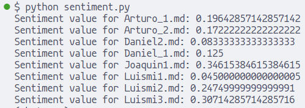
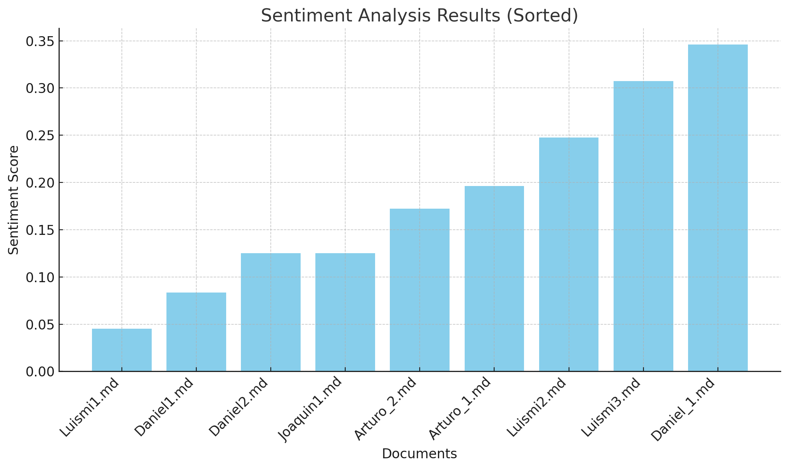

# Analysis of project results

## 1. Detail of the usability tests

See folder "6 Usability Test".

## 2. Materials used

To carry out the usability tests we used a series of tools to support us in their design, implementation and subsequent analysis:

- **Microsoft Teams** and **Discord**: These were used as a means of communication in some tests that could not be face-to-face.
- OBS**: This tool was used to record the videos of the usability tests.
- Online video format conversion software**: This was used to transform the recorded videos into a specific format for transcription.
- Transcription API**: The WhisperAI API was used to transcribe the usability test audios for later analysis.
- **TextBlob library**: Python programming language was used along with the Textblob library for sentimental analysis of the transcripts obtained.

## 3. Evidence

Attached are the videos of the implementation of the usability tests as well as the results obtained:

[Link to Google Drive](https://drive.google.com/drive/folders/1prmluYkyezwiZrWLAWwqYnLQjMR1n04o?usp=sharing)

## 4. Data analysis

### 4.1 Analysis of the test using the checklists 

According to the prototype, a checklist survey was conducted to help us determine if the user would have any difficulties when testing the prototype.

- In the first task which is to enter the lesson we have 10 checklist items of which all were answered as expected.
- In the second task of entering a lesson, we have 8 checklist items of which all were answered as expected and we managed to enter the lesson without complications, besides noticing that it was not possible to access a locked lesson.
- In the third task, which is the presentation of the selected lesson, we have 10 checklist items, all of which were answered as expected and there were no problems reading the content of the lessons.
- In the fourth task, which is to answer the questions, we have 15 checklist items that are divided into two parts, the first part is 6 items and the second part is 9 items; in the first part, if you answer A, it will tell you that you answered correctly; if you answer B, it will send you part two of the checklist items that will indicate that your answer was correct; of these 15 items, all of them were answered as expected.
- In the fifth task, which has 4 options, we have 4 checklist items which were answered correctly without any complications.
- In the sixth task, which is to relate columns, there are 14 checklist items, all of which were answered as expected and there were no complications when relating the information in the columns.
- In the seventh task, which is to drag the options, there are 5 checklist items which were all answered as expected and no participant had problems dragging the options to the correct blank space.
- In the eighth task which is after having finished the lesson we have 10 items of which all of them were answered well as they did not make mistakes in order to finish the lesson and choose the next lesson.
 
### 4.2 Sentiment Analysis

To analyze the data from the Thinking Aloud usability testing we decided to use sentiment analysis because given the amount of information gathered in the Thinking Aloud interviews we need a way to quickly get an idea of the interviewee experience during the test and sentiment analysis is a tool that manages to process big amounts of data in a short period of time.

Sentiment analysis is a way of analyzing data based on the positiveness or negativeness value of the words used during the interview. This allows us to find whether the interviewed users had positive or negative words when describing their ideas on the prototype. More negative words would indicate a poorer experience whereas positive ones would indicate a more pleasant one.

#### 4.2.1 Transcripts 

The transcriptions were possible thanks to the WhisperAI tool which was used as a separate module from the main project. The project can be found at the following link:

[GitHub Link](https://github.com/LuisMiguelMedina/AudioToText-WhisperAPI)

#### 4.2.2 Python Code

To conduct the sentiment analysis we used the TextBlob library in Python which allows us to analyze text content in a simple way.
The code used to perform the sentiment analysis on each transcript file can be found in the file "Sentiment Analysis Script.py" in the present folder.

```python
import os
from textblob import TextBlob

def get_text_sentiment(text):
    sentiment = text.sentiment.polarity
    return sentiment

def print_text_sentiment(filename, sentiment):
    print(f"Sentimiento para {filename}: {sentiment}")

def get_file_content(filepath):
    with open(filepath, 'r', encoding='utf-8') as file:
        file_content = TextBlob(file.read())
        return file_content

transcripts_dir = 'transcripts'
folder = os.listdir(transcripts_dir)

def build_relative_path(transcripts_dir, file):
    return os.path.join(transcripts_dir, file)

for file in folder:
    # Our transcripts are in markdown format, so we only want to analyze those files
    if not file.endswith('.md'): continue

    filepath = build_relative_path(transcripts_dir, file)
    file_content = get_file_content(filepath)
    sentiment = get_text_sentiment(file_content)
    print_text_sentiment(file, sentiment)
```


The code goes through all the files inside a folder that contains the transcriptions and then we calculate the sentiment of the transcription test. 

The results are presented as pairs: file name + sentiment value.

The sentiment being a number within [-1, 1]. -1 being negative words and 1 being positive ones and 0 being neutral. The closer the sentiment value to 1 the more positive the words on the transcript are. 

# Results

The outcome of the sentiment analysis is the following: 



In text:

- Sentiment value for Arturo_1.md: 0.19642857142857142
- Sentiment value for Arturo_2.md: 0.17222222222222222
- Sentiment value for Daniel2.md: 0.08333333333333333
- Sentiment value for Daniel_1.md: 0.125
- Sentiment value for Joaquin1.md: 0.34615384615384615
- Sentiment value for Luismi1.md: 0.045000000000000005
- Sentiment value for Luismi2.md: 0.24749999999999991
- Sentiment value for Luismi3.md: 0.30714285714285716

# Explanation of the Sentiment Analysis Graph

## Introduction



## Introduction
This bar graph presents the results of a sentiment analysis conducted on various documents. Sentiment analysis evaluates text content to determine the expressed attitude, which can be positive, negative, or neutral. In this case, all analyzed documents contain positive sentiments.

## X-Axis (Horizontal)
The X-axis of the graph lists the analyzed documents. Each document has a unique name, for example, "Arturo_1.md", "Arturo_2.md", etc. These names individually identify each document in the dataset.

## Y-Axis (Vertical)
The Y-axis shows the sentiment scores, which range from -1 to 1. These scores indicate the intensity of the sentiment detected in each document:

- -1: Completely negative sentiment (not present in this analysis).
- 0: Neutral sentiment.
- 1: Completely positive sentiment.

## Order of the Documents
The graph is ordered from lowest to highest, making it easy to identify the documents with the least positive and the most positive sentiments.

## Analysis of the Results

**Documents with Less Positive Sentiment:**

- "Luismi1.md" has the lowest score with approximately 0.045, indicating a slightly positive sentiment.
- "Daniel1.md" and "Daniel2.md" also show relatively low scores (0.083 and 0.125), suggesting a positive but less intense tone in those documents.

**Documents with Moderately Positive Sentiment:**

- "Daniel_1.md" and "Arturo_2.md" have scores around 0.125 and 0.172, respectively, suggesting a moderately positive sentiment.

**Documents with Very Positive Sentiment:**

- "Joaquin1.md" has the highest score with approximately 0.346, indicating a highly positive sentiment.
- "Luismi3.md" and "Luismi2.md" also have relatively high scores (0.307 and 0.247), suggesting a very positive tone in those documents.

## Conclusion
This graph is useful for visualizing how positive sentiment varies between different documents. By ordering the documents from least to most positive sentiment, it is easy to quickly identify which have the least positive and most positive tones, facilitating comparative analysis of the sentiments expressed in each document.
